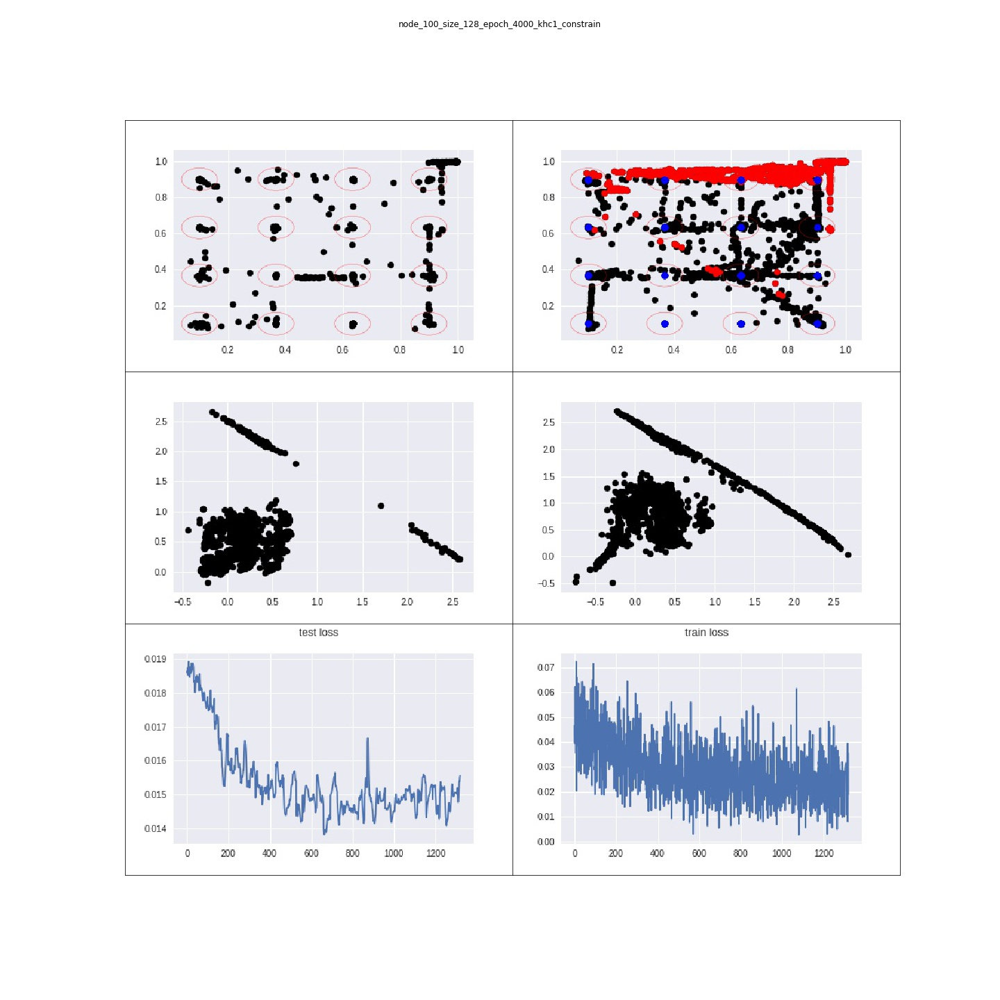

### 10주차

1. Outlier 제거 실험

  1. node 100  
  2. batch_size 128 -> 32부터 실험했었는데 학습에 너무 오랜 시간이 소모되어서 변경함
  3. epoch -> 4000 학습
  4. constrain 함수를 만들어서 사용 
    * ALX, ALY에 제곱을 하여 1을 초과하게 되면 그 데이터를 아웃라이어라고 생각하고 버림
    * 나머지 데이터로 학습함 -> 버려지는 데이터 개수는 각 데이터 마다 다름 ex) khc1 데이터의 경우 약 140개 정도가 버려짐 많으면 1000개까지...
    * 동공 정보는 아직 미포함

* khc 영상 1 데이터 학습 결과

* khc 영상 3 데이터 학습 결과

* ssh 영상 1 데이터 학습 결과

* ssh 영상 3 데이터 학습 결과

* yjh 영상 1 데이터 학습 결과

* yjh 영상 3 데이터 학습 결과

2. 동공 정보 활용

https://github.com/serereuk/RA_code/blob/master/10주차/pupil%20stats.ipynb

3. 영상으로 확인

* 원본 데이터 확인
  

* train 데이터 확인
 

* test 데이터 확인
 

