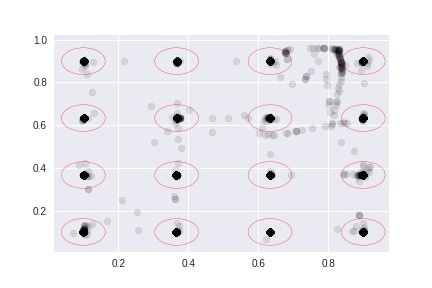

11주차
=====

### 1. ATT와 Fixation에 대한 연관성 확인

* ATT의 diff인 Delta time을 사용해서 Fixation과 연관성을 비교해봄.
* ADT, Gaze points와 Fixation는 본질적인 차이가 있음. -> Fixation은 어떠한 알고리즘으로 만들어진 것!  

Fixations have two characteristics distinguishing them from gaze points. The first is that since they are made up of multiple gaze points, fixations have duration in addition to a spatial (x, y) location and start and end timestamps. The second is that fixations are not real in the sense of being directly measurable. Fixations are constructions, outputs of a mathematical algorithm that translates the sequence of raw gaze points into an associated sequence of fixations. Paradoxically, fixations are real in the sense that they are meaningful episodes of looking generated by our visual system. These episodes have specific dynamic characteristics that the gaze point-to-fixation conversion algorithm, or fixation filter, is designed to model. So, putting the eye tracker-based raw gaze stream through the fixation filter is an attempt to reconstruct these meaningful eye movements as faithfully as possible.  

* 저번 주에 언급된 x, y 거리와 Fixation에 대한 연관성을 찾아보려고 함. -> 결과 corr이 -0.09..  
* Fixation label에 따라 나올 수 있는 diff는 차이는 있었지만 유의미한가...?는 아직 밝히지 못함.  
* https://github.com/serereuk/RA_code/blob/master/11주차/delta%20time%20fixation.ipynb

### 2. Fixation based 학습 효과 확인

* 기존 모델에 Fixation이 높은 점들을 넣어서 계산시에 어떠한 결과가 보이는가? -> 학습 시간은 좀 빨리짐  
* 기존(constrain이 있는 모형)과 다른 것이 별로 없다고 생각함.  
* 결과는 아래서 확인 가능  
** constrain model  
  

  

** fixation model  
  

  

### 3. Movie Eye tracking Data 전처리  

* 27명의 데이터를 받았으며 각각 4개 혹은 2개의 데이터를 갖고 있음.  
* 모든 txt 파일은 전처리를 완료했으나 etime에 관련된 정보를 아직 반영하지 못함. -> 진행중  

### 4. 시간에 따른 동공 확대에 관련된 시각화  

* https://plot.ly/~serereuk/16 -> width  
* https://plot.ly/~serereuk/18 -> height  

* label에 따른 apw 분포 확인  

  

* label에 따른 aph 분포 확인   

  
