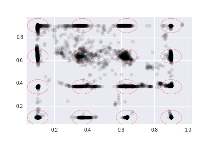
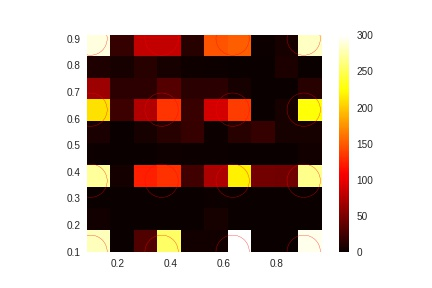
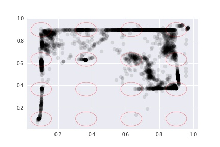

12주차
=====

1. distance based learning  
* 거리 분포를 계산해서 95%인 친구들만 가지고 학습시킴  
* 결과가 좀 향상된 모습을 보임  
* 노드 수도 100개에서 50개로 줄임  

### 결과 

* 10개인 경우 

2. Two eye data based learning
* 앞서 언급한 방식과 함께 사용
* 두 눈의 좌표가 인풋이며 [alx, blx, aly, bly] 형식
* 6개 레이어 성능이 별로 좋지 않음 -> 레이어를 늘릴 필요가 있을지도... 

### 결과

3. Pupillary Response with pupil dialation 논문  
* 다른 논문들을 통해서 동공 반응에 대한 선행 연구를 확인중  
* 다른 논문들 같은 경우에는 diameter를 계산해서 진행중... 

### 각 논문 소개

4. 전처리 자동화 -> 거의 성공
* etime 파일 인식 성공 -> 실험의 시간 흐름을 이해할 수 있음
* 시각화 자동화 진행중  

