12주차
=====

1. distance based learning  
* 거리 분포를 계산해서 95%인 친구들만 가지고 학습시킴  
* 결과가 좀 향상된 모습을 보임  
* 노드 수도 100개에서 50개로 줄임  

### 결과 

* 10개인 경우 

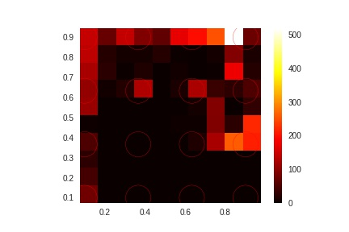

* 40개인 경우  

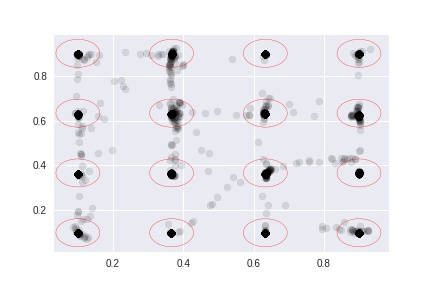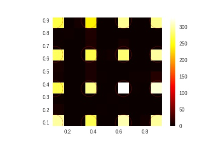
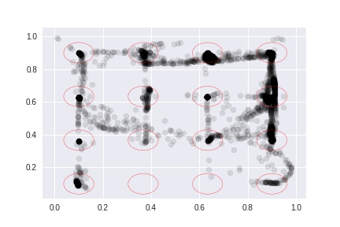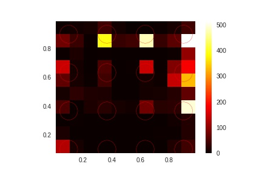

* 50개인 경우

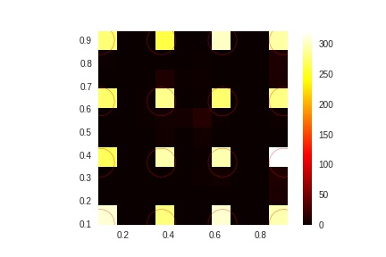
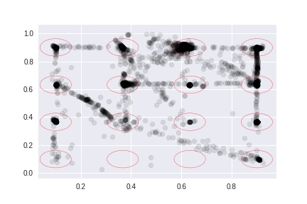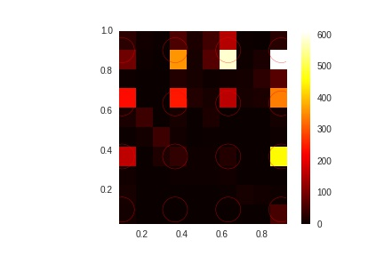

2. Two eye data based learning
* eyeA와 eyeB는 유사한 형태를 보임!
* 앞서 언급한 방식과 함께 사용
* 두 눈의 좌표가 인풋이며 [alx, blx, aly, bly] 형식
* 6개 레이어 성능이 별로 좋지 않음 -> 레이어를 늘릴 필요가 있을지도... 

* eyeA, eyeB 영상 시작 전 패러다임 모습

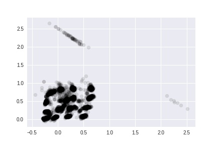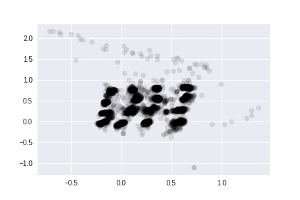

* eyeA, eyeB 영상 본 후 패러다임 모습

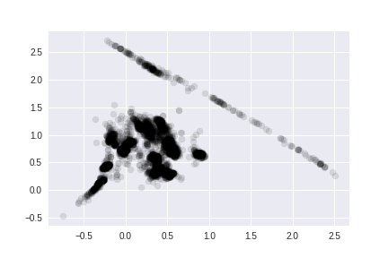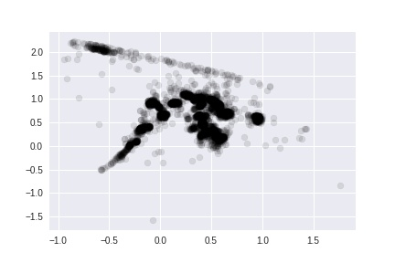

* 에폭 4000인 경우  

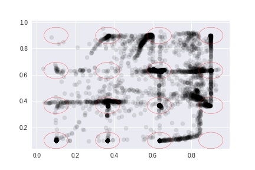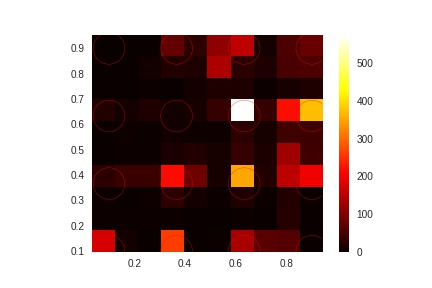
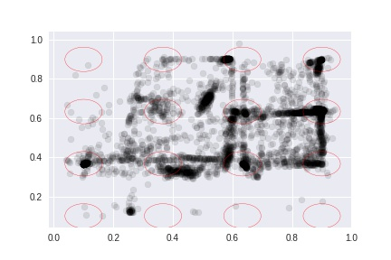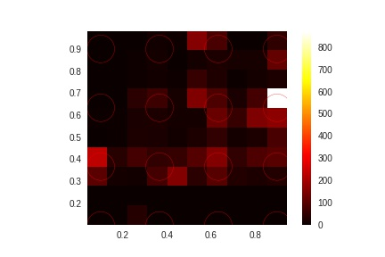

* 에폭 5000인 경우

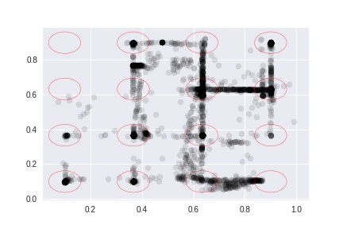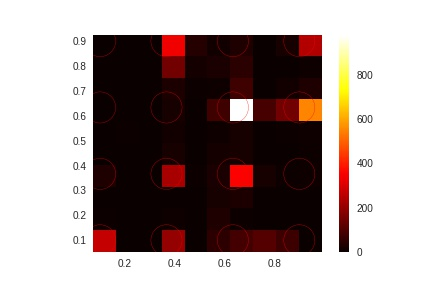
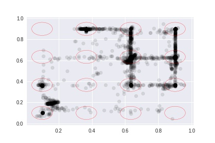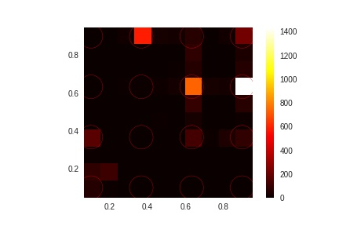

### 결과

3. Pupillary Response with pupil dialation 논문  
* 다른 논문들을 통해서 동공 반응에 대한 선행 연구를 확인중  
* 다른 논문들 같은 경우에는 diameter를 계산해서 진행중... 

* 1. Pupillary Responses and Chronminance Components in Natural Viewing Conditions (Doohwan Lee, Manho Jang, Doo-Jin Park 2017)  
목적: 본 연구는 일반 시청 조건하에서 색상 성분과 동공 반응과의 기능적 관계를 알아보고자 시행되었다. 방법:
정상 시력을 가진 12명의 피험자들의 동공 데이터는 45분간 뮤직비디오를 시청하는 동안에 아이트래커를 통해 수
집되었고, 이 데이터는 색상, 채도 및 명도와 같은 색상 성분들과 함께 분석하였다. 결과: 동공 분석 결과 산동과 축
동은 반응 횟수와 반응량이 유사하였다. 색상들의 총 노출 횟수는 동공 반응량과 정적 상관관계를 보였고, 이러한
관계는 6가지 대표 색상들 중에서 빨강과 노랑에서 보편적 특징으로 나타났다. 축동 횟수와 축동량은 채도와 명도
수준과 유의한 관계를 보이지는 않았지만, 산동 횟수와 산동량은 채도와는 정적 상관관계를 가졌고 명도와는 부적
상관관계를 보였다. 결론: 색상 성분들은 기능적으로 축동 보다는 산동과 더 밀접한 관계가 있는 것으로 사료된다.

### 각 논문 소개

4. 전처리 자동화 -> 거의 성공
* etime 파일 인식 성공 -> 실험의 시간 흐름을 이해할 수 있음
* 시각화 자동화 진행중  

