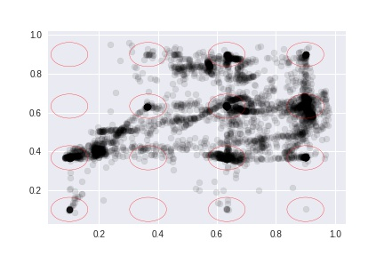

13주차
=====

### 1. start diffrent middle concat end same model  

* 교수님이 말씀해주신 것에 대해서 영감을 받아서 만든 모델
* 두 눈에 대한 x,y 좌표가 처음에 다르게 들어감!  
* 6개 레이어를 사용 두 눈에서 처음 올릴 때 피쳐 값들을 concat해서 사용
* 결과는 별로...  

### 결과 

* node 150개인 경우  

* node 100개인 경우

### 2. start diffrent middle diffrent end concat model 

* 누워있다가 영감을 얻고 만듦 -> 6개 레이어가 성능이 각각 좋았으니 서로 6개 거치고 나중에 합하며 어떻게 될까라는 순수한 생각에서 만듦.
* 두 눈에 대한 x,y 좌표가 처음에 다르게 들어가고 서로 각자 학습하다가 나중에 컨켓되어 만남.
* 역시나 결과는 별로...

### 결과 

* node 100개인 경우

* node 10개인 경우

### 3. Multimodal Emotion Recognition in Response to Videos(Mohammad Soleymani, Member, IEEE)

  논문이 찾고 싶은 것은 EEG 신호 뿐만 아니라 동공 크기의 변화등을 사용하여 감정을 분류하는 모델을 만드려고 함.
  

 
