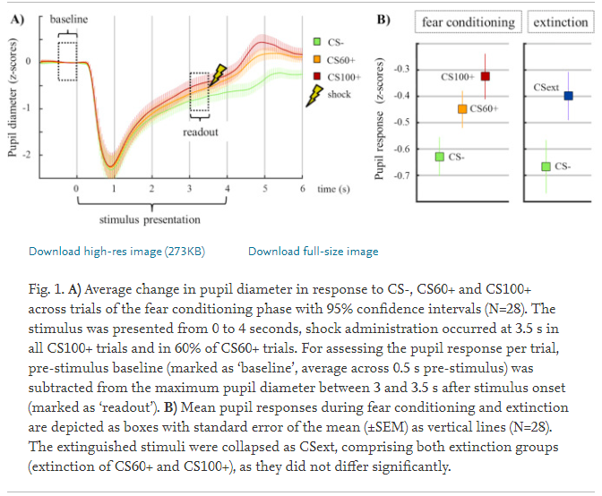
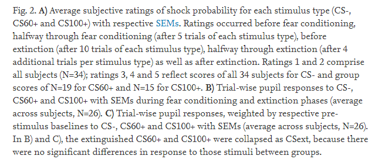

15주차
=====

### Pupil size data에 대한 다양한 연구 방법 조사

* 1. Neural correlates of pupil dilation during human fear learning, Laura Leuchs, Max Schneider, Michael Czisch, Victor I. Spoormaker, NeuroImage, Volume 147, 2017, Pages 186-197

* 2. Modeling cognitive load and physiological arousal through pupil diameter and heart rate, Jerčić, P., Sennersten, C. & Lindley, C. Multimed Tools Appl (2018). https://doi.org/10.1007/s11042-018-6518-z

* 3. Homeostatic circuits selectively gate food cue responses in insular cortex, Yoav Livneh 외 여러명, Nature, 2017

* 4. The pupil as a measure of emotional arousal and autonomic activation, Margaret M.Bradley, Laura Miccoli, Psychophysiology, 2008, 602-607  

* 5. Low-dose intranasal oxytocin delivered with Breath Powered device modulates pupil diameter and amygdala activity: a randomized controlled pupillometry and fMRI study, Daniel S. Quintana 1, Lars T. Westlye 1,2, Dag Alnæs 1, Tobias Kaufmann1, Ramy A. Mahmoud3, Knut T. Smerud4, Per G. Djupesland5 and Ole A. Andreassen, Nature, (2019), Neuropsychopharmacology


  
pupil analysis에 대한 전반적인 workflow
=======================================

### pupil analysis - preprocessing

* segment data into individual trials
* clean up the data(missing data, eye blinks, linear interpolation)
* small timewindows before and after the missing data/artefacts are taken, and replaced with custom linear interpolation

### baseline correction
* 1. baseline(200ms before stimulus onset) is chosen and then subtract from the data after stimulus onset  
-> time window before stimulus onse
* 2. z-score

### phasic vs tonic

* phasic: change in pupil diameter in response to a stimulus
* tonic: baseline pupil diameter

#### from Pupillometry for dummies - 2017, Yunzhe liu, UCL

논문 각각 방법 소개
==================

### 1. Neural correlates of pupil dilation during human fear learning

```
highlights
* pupil response during fear learning are associated with dACC and thalamus activity
* Phasic pupil responses do not show substantial habituation during fear learning
* Phasic pupil responses are negatively correlated with tonic pupil size
* Pupillometry can track conditioned respones on a trial by trial level.

```
### conclusion

Pupil dilations during fear conditioning and extinction provide useful readouts to track fear learning on a trial-by-trial level, particularly with simultaneous fMRI. Whereas phasic pupil responses reflect activity in brain regions involved in fear learning and threat appraisal, most prominently in dACC, tonic changes in pupil diameter may reflect changes in general arousal.

### pupil data로서 적용한 부분

* 1. linear interpolation with small window before (M=56 ms, range=20–60 ms, SD=8 ms) to shortly after eye blinks (M=128 ms, range=40–180 ms, SD=28 ms)
* 2. 각 subject들의 데이터를 z transformed를 하여 비교하였다.
* 3. exclude the sudden and large jumps in pupil diameter, which are typically caused by undetected blink artifacts or sudden changes in gaze direction.
* 4. First order derivative를 각 epoch마다 적용하여 3.3 표준오차보다 큰 친구들은 제거
-> Then the first order derivatives were examined for every single epoch. If the derivative of an epoch differed by more than 3.3 standard deviations from the mean derivative of the same epoch of all other trials in this subject, the whole corresponding trial was discarded as an outlier
* 5. 중앙이 아닌 다른 곳을 보고 있었던 데이터도 제거.






https://www.sciencedirect.com/science/article/pii/S1053811916306905?via%3Dihub

### 2. Modeling cognitive load and physiological arousal through pupil diameter and heart rate


### pupil data로서 적용한 부분

* 1. linear interpolation
* 2. baseline diameter를 통해서 normalize를 함.


### 3. Homeostatic circuits selectively gate food cue responses in insular cortex

https://media.nature.com/original/nature-assets/nature/journal/v546/n7660/extref/nature22375-s1.pdf

pupil data로서 적용한 부분

1. 쥐를 사용했다...

### 4. The pupil as a measure of emotional arousal and autonomic activation


```
The data provide strong support for the hypothesis that the pupil's reponse during affective picture viewing reflects emotional arousal
associated with increased sympathetic activity
```

### pupil data로서 적용한 부분

* 1. linear interpolation
* 2. For each trial, a 1-s prepicture baseline average was subtracted.
* 3. Pupillary response when viewing affective pictures shows greater pupillary increases following the initial light reflex for pleasant and unpleasant, compared to neutral, pictures, indicating modulation by emotional arousal. 
* 4. 빛 반응을 제외하거나 그러지 않은듯!

```
An initial decrease in pupil diameter following picture onset was strongly related to luminance as expected, and experimental control
insured that this initial light reflex did not differ as a function of picture content, allowing an assessment of emotion on pupillary
changes during picture perception. The data clearly indicated that, following the initial light reflex, pupillary increases were larger
when participants viewed pleasant or unpleasant, compared to neutral, pictures. These data disconfirm earlier hypotheses regarding
differential pupillary changes as a function of hedonic valence (Hess & Polt, 1960) and support the more recent consensus that pupil
diameter increases when people process emotionally engaging stimuli, regardless of hedonic valence. In a recent study, Partala,
Jokiniemi, and Surakka (2000) reported increased pupil dilation even when participants listened to affectively engaging, compared to
neutral, sounds, suggesting that emotional arousal prompts pupillary increases even when the perceptual context is not visual.

```

### 5. Low-dose intranasal oxytocin delivered with Breath Powered device modulates pupil diameter and amygdala activity: a randomized controlled pupillometry and fMRI study

```
Little is known about how intranasally administered oxytocin reaches the brain and modulates social behavior and cognition.
Pupil dilation is a sensitive index of attentional allocation and effort, and inter-individual variability in pupil diameter
during performance of social-cognitive tasks may provide a better assessment of pharmacological effects on the brain than
behavioral measures.
```


