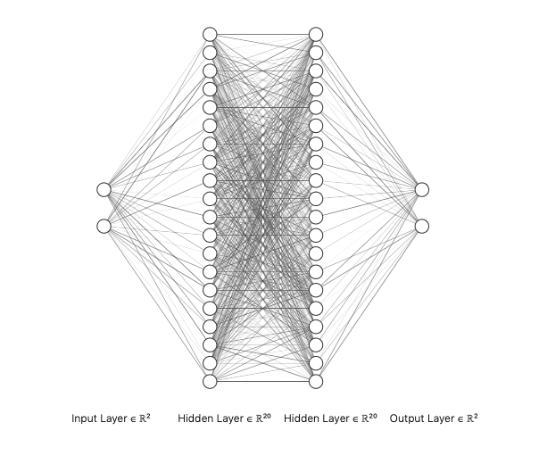

# RA_code

## 'Eye Tracking Data Recalibration and Visualization'  

7주차 활동 내역  

1. ANN 구현 및 확인  
* ANN 레이어 및 노드 개수 실험  
1) 레이어 1개 노드 10, 20, 30개  
2) 레이어 2개 노드 (20, 10), (20, 20)
[]  

* 다른 데이터에 적용할 때 어떠한 결과인지 확인  
* 다른 눈 데이터에 적용할 때 어떠한 결과인지 확인  

2. SVR 구현 및 확인  
* SVR 파라메터 튜닝  
* 다른 데이터에 적용할 떄 어떠한 결과인지 확인  
* 다른 눈 데이터에 적용할 때 어떠한 결과인지 확인  

3. Video 파이썬에 올리고 시각화  
* 만든 패러다임으로 아예 범용화 코드를 만드는 중  

* 패러다임 모습

  

* 원본 데이터 시각화

  

* 수정 후 데이터 시각화

  

4. 영상 데이터 확인 및 시선이 집중될 만한 장면 찾기 
* 영상마다 시선이 집중될만한 장면 시간 체크 중..  
